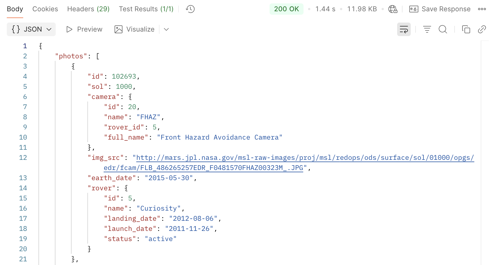
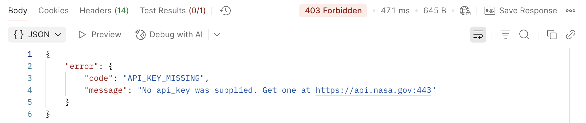

# NASA Mars Rover Photos API

## What the API does

Returns raw images taken by NASA’s Mars rovers. Supports queries by Martian sol, Earth date, or camera filter.

## Base Endpoint

`GET https://api.nasa.gov/mars-photos/api/v1/rovers/curiosity/photos`

## Parameters

| Name        | Type     | Required | Example             | Notes |
|-------------|----------|----------|---------------------|-------|
| `api_key`   | string   | Yes      | `DEMO_KEY`          | Use `DEMO_KEY` for testing or [request a personal key](https://api.nasa.gov/) (Generate API Key). |
| `sol`       | integer  | One of   | `1000`              | Martian solar day (starting at landing). Provide **either** `sol` **or** `earth_date`. If both are sent, `sol` is used. |
| `earth_date`| date     | One of   | `2015-05-30`        | Earth date in `YYYY-MM-DD`. Provide **either** `earth_date` **or** `sol`. |
| `camera`    | string   | No       | `FHAZ`              | Filter by camera. Valid values listed below. |
| `page`      | integer  | No       | `2`                 | Pagination (default 1). Use to fetch additional results. |

## Valid Cameras (Curiosity)

| Code   | Full Name        |
|-------------- |------------------------------------- |
| FHAZ   | Front Hazard Avoidance Camera  |
| RHAZ   | Rear Hazard Avoidance Camera  |
| MAST   | Mast Camera       |
| CHEMCAM | Chemistry and Camera Complex  |
| MAHLI  | Mars Hand Lens Imager    |
| MARDI  | Mars Descent Imager     |
| NAVCAM  | Navigation Camera     |

> Note: Other rovers (Opportunity, Spirit, Perseverance) have slightly different camera sets. Refer to the [Mars Rover Photos API docs](https://api.nasa.gov/) for the complete list.
---

## Example Requests

```http
# By sol (common)
GET https://api.nasa.gov/mars-photos/api/v1/rovers/curiosity/photos?sol=1000&api_key=DEMO_KEY
# By Earth date
GET https://api.nasa.gov/mars-photos/api/v1/rovers/curiosity/photos?earth_date=2015-05-30&api_key=DEMO_KEY
# Filtered by camera + paginated
GET https://api.nasa.gov/mars-photos/api/v1/rovers/curiosity/photos?sol=1000&camera=FHAZ&page=2&api_key=DEMO_KEY
```

## Example JSON Response

```json
{
  "photos": [
    {
      "id": 424905,
      "sol": 1000,
      "camera": {
        "id": 20,
        "name": "FHAZ",
        "rover_id": 5,
        "full_name": "Front Hazard Avoidance Camera"
      },
      "img_src": "http://mars.nasa.gov/msl-raw-images/proj/msl/redops/ods/surface/sol/01000/opgs/edr/fcam/FRB_486897715EDR_F0481570FHAZ00323M_.JPG",
      "earth_date": "2015-05-30",
      "rover": {
        "id": 5,
        "name": "Curiosity",
        "landing_date": "2012-08-06",
        "launch_date": "2011-11-26",
        "status": "active"
      }
    },
    {
      "id": 424906,
      "sol": 1000,
      "camera": {
        "id": 21,
        "name": "MAST",
        "rover_id": 5,
        "full_name": "Mast Camera"
      },
      "img_src": "http://mars.nasa.gov/msl-raw-images/msss/01000/mcam/1000MR0044631300503690E01_DXXX.jpg",
      "earth_date": "2015-05-30",
      "rover": {
        "id": 5,
        "name": "Curiosity",
        "landing_date": "2012-08-06",
        "launch_date": "2011-11-26",
        "status": "active"
      }
    }
  ]
}
```

## Postman Examples

Here’s what a successful request looks like in Postman:

Sol:


Earth Date:


---

## Example Error Response (403)

Returned when the `api_key` is missing or invalid.



## Field Guide

- `id`: Unique identifier for the photo.  
- `sol`: Martian solar day when the photo was taken.  
- `camera`: Object containing details about the camera.  

  - `name`: Short camera code (e.g., `FHAZ`, `MAST`).  
  - `full_name`: Full descriptive name (e.g., `Front Hazard Avoidance Camera`, `Mast Camera`).  

- `img_src`: Direct URL to the photo.  
- `earth_date`: Earth calendar date when the photo was taken.  
- `rover`: Object containing rover details.  

  - `name`: Name of the rover (e.g., `Curiosity`).  
  - `status`: Mission status (e.g., `active`).  

## Errors

- **403** – Forbidden (bad or missing `api_key`).
- **400** – Bad Request (invalid parameter, e.g., wrong date format).
- **429** – Too many requests (rate limit).
