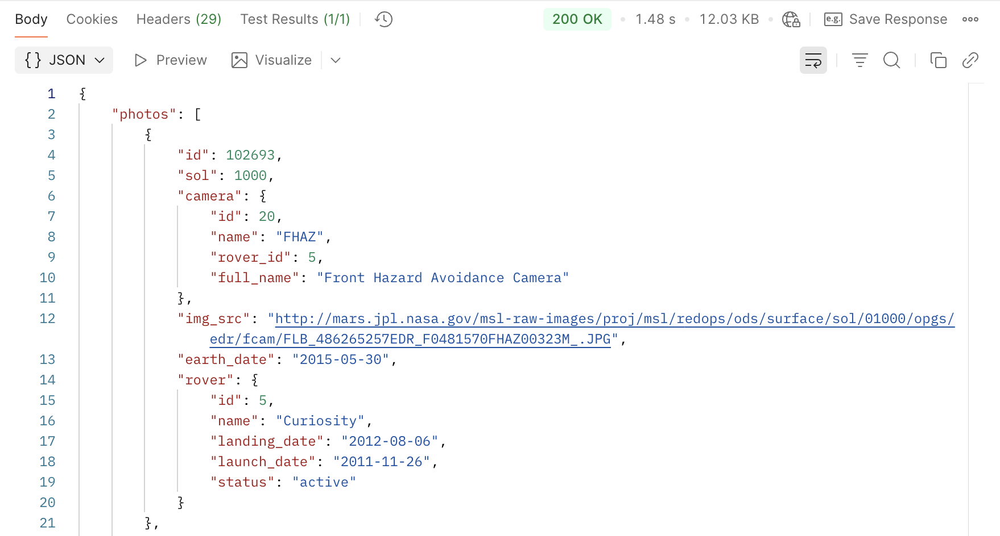
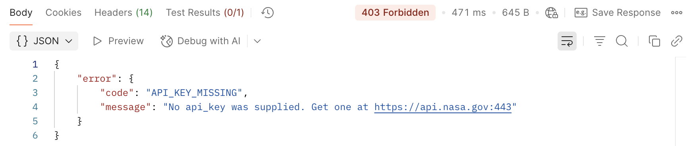

# NASA Mars Rover Photos API

## Overview

The NASA Mars Rover Photos API provides access to raw images taken by NASA's Mars rovers (Curiosity, Opportunity, Spirit, and Perseverance). Query photos by Martian solar day (sol), Earth date, or filter by specific rover cameras to access thousands of images captured during Mars exploration missions.

Curiosity and Perseverance are currently active missions, while Opportunity and Spirit missions are complete, so their image sets are finite.

## Endpoint

`GET https://api.nasa.gov/mars-photos/api/v1/rovers/{rover}/photos`

## Path Parameters

| Parameter | Type | Required | Description | Valid Values |
|-----------|------|----------|-------------|--------------|
| `rover` | string | Yes | Name of the Mars rover | `curiosity`, `opportunity`, `spirit`, `perseverance` |

## Authentication

This API requires an API key for authentication:

- **Demo usage**: Use `DEMO_KEY` for testing (limited to 30 requests per hour)
- **Production usage**: [Get your free API key](https://api.nasa.gov/) (1000 requests per hour)

## Query Parameters

| Parameter | Type | Required | Description | Example |
|-----------|------|----------|-------------|---------|
| `api_key` | string | Yes | Your NASA API key or `DEMO_KEY` | `DEMO_KEY` |
| `sol` | integer | One of* | Martian solar day (starting from rover's landing) | `1000` |
| `earth_date` | string | One of* | Earth date in YYYY-MM-DD format | `2015-05-30` |
| `camera` | string | No | Filter by specific camera ([see codes](#camera-codes)) | `FHAZ` |
| `page` | integer | No | Page number for pagination (default: 1) | `2` |

*You must provide either `sol` OR `earth_date` (not both). If both are provided, `sol` takes precedence.

## Camera Codes

### Curiosity Rover Cameras

| Code | Full Name |
|------|-----------|
| `FHAZ` | Front Hazard Avoidance Camera |
| `RHAZ` | Rear Hazard Avoidance Camera |
| `MAST` | Mast Camera |
| `CHEMCAM` | Chemistry and Camera Complex |
| `MAHLI` | Mars Hand Lens Imager |
| `MARDI` | Mars Descent Imager |
| `NAVCAM` | Navigation Camera |

### Perseverance Rover Cameras

| Code | Full Name |
|------|-----------|
| `EDL_RUCAM` | Rover Up-Look Camera |
| `EDL_RDCAM` | Rover Down-Look Camera |
| `EDL_DDCAM` | Descent Stage Down-Look Camera |
| `EDL_PUCAM1` | Parachute Up-Look Camera A |
| `EDL_PUCAM2` | Parachute Up-Look Camera B |
| `NAVCAM_LEFT` | Navigation Camera - Left |
| `NAVCAM_RIGHT` | Navigation Camera - Right |
| `MCZ_LEFT` | Mast Camera Zoom - Left |
| `MCZ_RIGHT` | Mast Camera Zoom - Right |
| `FRONT_HAZCAM_LEFT_A` | Front Hazard Avoidance Camera - Left A |
| `FRONT_HAZCAM_RIGHT_A` | Front Hazard Avoidance Camera - Right A |
| `REAR_HAZCAM_LEFT` | Rear Hazard Avoidance Camera - Left |
| `REAR_HAZCAM_RIGHT` | Rear Hazard Avoidance Camera - Right |

### Other Rovers

Opportunity and Spirit rovers have additional camera configurations. Check the [official NASA documentation](https://api.nasa.gov/) for complete camera listings per rover.

## Example Requests

```http
# Get photos by Martian sol
GET https://api.nasa.gov/mars-photos/api/v1/rovers/curiosity/photos?sol=1000&api_key=DEMO_KEY

# Get photos by Earth date
GET https://api.nasa.gov/mars-photos/api/v1/rovers/curiosity/photos?earth_date=2015-05-30&api_key=DEMO_KEY

# Filter by camera and paginate
GET https://api.nasa.gov/mars-photos/api/v1/rovers/curiosity/photos?sol=1000&camera=FHAZ&page=2&api_key=DEMO_KEY

# Get Perseverance rover photos
GET https://api.nasa.gov/mars-photos/api/v1/rovers/perseverance/photos?sol=100&api_key=DEMO_KEY
```

## Example Response

```json
{
  "photos": [
    {
      "id": 424905,
      "sol": 1000,
      "camera": {
        "id": 20,
        "name": "FHAZ",
        "rover_id": 5,
        "full_name": "Front Hazard Avoidance Camera"
      },
      "img_src": "https://mars.nasa.gov/msl-raw-images/proj/msl/redops/ods/surface/sol/01000/opgs/edr/fcam/FRB_486897715EDR_F0481570FHAZ00323M_.JPG",
      "earth_date": "2015-05-30",
      "rover": {
        "id": 5,
        "name": "Curiosity",
        "landing_date": "2012-08-06",
        "launch_date": "2011-11-26",
        "status": "active"
      }
    }
  ]
}
```

## Response Fields

| Field | Type | Description |
|-------|------|-------------|
| `photos` | array | Array of photo objects |
| `photos[].id` | integer | Unique identifier for the photo |
| `photos[].sol` | integer | Martian solar day when photo was taken |
| `photos[].camera` | object | Camera information object |
| `photos[].camera.id` | integer | Unique camera identifier |
| `photos[].camera.name` | string | Short camera code (e.g., "FHAZ") |
| `photos[].camera.rover_id` | integer | Associated rover identifier |
| `photos[].camera.full_name` | string | Full descriptive camera name |
| `photos[].img_src` | string | Direct URL to the raw image file |
| `photos[].earth_date` | string | Earth date when photo was taken (YYYY-MM-DD) |
| `photos[].rover` | object | Rover information object |
| `photos[].rover.id` | integer | Unique rover identifier |
| `photos[].rover.name` | string | Rover name (e.g., "Curiosity") |
| `photos[].rover.landing_date` | string | Date rover landed on Mars |
| `photos[].rover.launch_date` | string | Date rover was launched from Earth |
| `photos[].rover.status` | string | Current mission status ("active" or "complete") |

## Testing in Postman

Here's what successful requests look like in Postman:

**By Sol:**


**By Earth Date:**


**Perseverance Rover:**


## Error Responses

### 400 Bad Request

Occurs when request parameters are invalid or malformed.

```json
{
  "error": {
    "code": "BAD_REQUEST",
    "message": "Invalid date format. Use YYYY-MM-DD."
  }
}
```

### 403 Forbidden

Occurs when API key is invalid or missing.

```json
{
  "error": {
    "code": "API_KEY_INVALID", 
    "message": "An invalid api_key was supplied. Get one at https://api.nasa.gov/"
  }
}
```



### 404 Not Found

Occurs when no photos are found for the specified parameters.

```json
{
  "photos": []
}
```

### 429 Too Many Requests

Occurs when rate limit is exceeded.

```json
{
  "error": {
    "code": "OVER_RATE_LIMIT",
    "message": "You have exceeded your rate limit. Try again later."
  }
}
```

## Rate Limits

- **DEMO_KEY**: 30 requests per hour per API key
- **Registered API key**: 1,000 requests per hour per API key

## Notes

- Photos are available starting from each rover's landing date
- Not all sols have available photos (rovers don't take photos every day)
- Image URLs point directly to NASA's raw image servers
- Empty results return `{"photos": []}` rather than an error
- Sol 0 represents each rover's landing day
- Different rovers have different camera configurations and capabilities

## Quick Start Examples

```bash
# Get today's photos from Curiosity (if any)
curl "https://api.nasa.gov/mars-photos/api/v1/rovers/curiosity/photos?earth_date=$(date +%Y-%m-%d)&api_key=DEMO_KEY"

# Get front camera photos from a specific sol
curl "https://api.nasa.gov/mars-photos/api/v1/rovers/curiosity/photos?sol=1000&camera=FHAZ&api_key=DEMO_KEY"

# Get photos from Perseverance rover
curl "https://api.nasa.gov/mars-photos/api/v1/rovers/perseverance/photos?sol=100&api_key=DEMO_KEY"
```

---

**API Version:** v1  
**Doc Version:** v2.0  
**Last Updated:** Maintained regularly

For support or questions about this documentation, please check my [project repository](https://github.com/jerrybensonjr/api-samples). For the official NASA Mars Rover Photos API source and technical support, visit the [NASA Open Data Portal](https://api.nasa.gov/).
