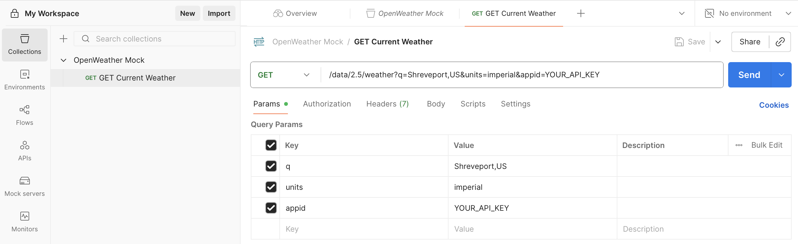

# How To: Set Up a Postman Mock Server with Fixture Data

> **Portfolio Sample:** This tutorial was created by Jerry Benson to demonstrate step-by-step instructional documentation for API testing workflows. The goal is to teach how to set up a Postman Mock Server using sample JSON fixture files, making it accessible even to those new to Postman or API testing.

---

## Overview

A **Postman Mock Server** lets you simulate an API's behavior without connecting to the live endpoint. This is valuable when:

- The real API requires a paid subscription or limited free tier
- You need predictable, repeatable responses for testing
- The API is under development and not yet available
- You want to test error handling without triggering actual errors

This tutorial uses the OpenWeather Current Weather API as a practical example. By the end, you will be able to:

- Create a Postman collection and organize requests
- Add multiple example responses (success and error cases) using fixture files
- Configure and deploy a mock server
- Test different response scenarios using mock response headers

**Time Required:** 15-20 minutes

**Difficulty Level:** Beginner-friendly (no coding required)

---

## Prerequisites

**Required:**

- Free [Postman](https://www.postman.com/) account (desktop app recommended, web version also works)
- The five fixture JSON files from this repository (see [Understanding Fixture Files](#understanding-fixture-files))

**Helpful Context:**

- Basic familiarity with REST APIs and HTTP status codes
- Understanding of JSON structure (but no editing required)

**Related Documentation:**

- [OpenWeather Current Weather API Documentation](../openweather-current-weather-api.md) - The API we're mocking in this tutorial

---

## Workflow Overview

Here's the complete journey we'll follow:

### Collection → Request → Examples → Mock Server → Testing

1. Create a collection to organize your work
2. Add a request representing the API endpoint
3. Attach example responses from fixture files
4. Deploy a mock server to serve those examples
5. Test different scenarios using mock headers

---

## Understanding Fixture Files

**Fixture files** are sample JSON responses that represent what a real API would return. They allow you to test your application's behavior without making actual API calls.

This tutorial uses five fixture files stored in `/fixtures/openweather/`. Here are the five core response types you'll simulate, from success to errors:

### 1. Success Response (`openweather-weather.json`)

```json
{
  "coord": {
    "lon": -93.7502,
    "lat": 32.5252
  },
  "weather": [
    {
      "id": 800,
      "main": "Clear",
      "description": "clear sky",
      "icon": "01d"
    }
  ],
  "main": {
    "temp": 75.2,
    "feels_like": 76.1,
    "temp_min": 73.0,
    "temp_max": 77.0,
    "pressure": 1013,
    "humidity": 60
  },
  "wind": {
    "speed": 5.75,
    "deg": 180,
    "gust": 8.5
  },
  "sys": {
    "country": "US",
    "sunrise": 1695630000,
    "sunset": 1695672000
  },
  "name": "Shreveport",
  "cod": 200
}
```

- Complete weather data for Shreveport, LA
- HTTP status: 200 OK
- Represents successful API response

### 2. Authentication Error (`openweather-401.json`)

```json
{
  "cod": 401,
  "message": "Invalid API key. Please see https://openweathermap.org/faq#error401 for more info."
}
```

- HTTP status: 401 Unauthorized
- Triggered when API key is missing or invalid

### 3. Not Found Error (`openweather-404.json`)

```json
{
  "cod": "404",
  "message": "city not found"
}
```

- HTTP status: 404 Not Found
- Triggered when requested city doesn't exist in database

### 4. Rate Limit Error (`openweather-429.json`)

```json
{
  "cod": 429,
  "message": "Your account has exceeded the rate limit. Please wait before making additional requests."
}
```

- HTTP status: 429 Too Many Requests
- Triggered when API rate limits are exceeded

### 5. Server Error (`openweather-500.json`)

```json
{
  "cod": 500,
  "message": "Internal server error"
}
```

- HTTP status: 500 Internal Server Error
- Triggered when API experiences server-side issues

**Why These Fixtures?**

These represent the five most common response scenarios documented in the [OpenWeather API Error Responses section](../openweather-current-weather-api.md#error-responses). Having fixtures for each lets you test how your application handles both success and failure cases.

---

## Step 1: Create a Collection

Collections in Postman organize related API requests. Think of them as folders for your API testing work.

**Instructions:**

1. Open Postman (desktop app or web)
2. In the left sidebar, click **Collections**
3. Click **+ (New Collection)** or press `Ctrl+N` (Windows) / `Cmd+N` (Mac)
4. Name the collection: `OpenWeather Mock`
5. Click **Create**

**Expected Outcome:**

The collection appears in your sidebar. If you don't see it, check that you clicked **Create** instead of closing the dialog.

<details>
<summary>📸 Click to view screenshot</summary>


</details>

---

## Step 2: Add a Request to the Collection

Now we'll create a single request that represents calling the OpenWeather API.

**Instructions:**

1. Click on your **OpenWeather Mock** collection to select it
2. Click **Add a request** (or use the three-dot menu → Add Request)
3. Name the request: `GET Current Weather`
4. Set the HTTP method dropdown to **GET**
5. In the URL field, enter the endpoint path with query parameters:

   ```bash
   /data/2.5/weather?q=Shreveport,US&units=imperial&appid=YOUR_API_KEY
   ```

6. Click **Save**

**Expected Outcome:**

The request appears under your collection with the GET method badge. Note: We're using only the path (not full URL) because the mock server will provide the domain later.

<details>
<summary>📸 Click to view screenshot</summary>



</details>

---

## Step 3: Add Example Responses from Fixtures

Examples in Postman are saved responses that your mock server will return. We'll create five examples—one for each fixture file.

### Adding the 200 Success Example

**Instructions:**

1. With your **GET Current Weather** request open, click **Save ▾** (dropdown arrow)
2. Select **Save as example**
3. Postman creates a new example and switches to the **Examples** tab
4. Open your `openweather-weather.json` file and copy its entire contents
5. In Postman's **Response Body** section, paste the JSON
6. Set **Status** dropdown to `200 OK`
7. Rename the example (click the example name at top): `200 Success - Shreveport`
8. Click **Save**

**Expected Outcome:**

The example appears in the Examples tab with status 200. If the JSON looks malformed, Postman will highlight syntax errors in red—check you copied the complete file.

<details>
<summary>📸 Click to view screenshot</summary>


</details>

### Adding Error Response Examples

Repeat the process above for each error fixture:

| Fixture File | Status Code | Example Name |
|--------------|-------------|--------------|
| `openweather-401.json` | `401 Unauthorized` | `401 Invalid API Key` |
| `openweather-404.json` | `404 Not Found` | `404 City Not Found` |
| `openweather-429.json` | `429 Too Many Requests` | `429 Rate Limit Exceeded` |
| `openweather-500.json` | `500 Internal Server Error` | `500 Server Error` |

**Expected Outcome:**

Your Examples tab shows all five examples with their respective status codes. If you're missing any, go back and repeat the "Save as example" process.

<details>
<summary>📸 Click to view screenshot</summary>


</details>

---

## Step 4: Create the Mock Server

Now we'll deploy a mock server that serves these example responses.

**Instructions:**

1. Click **New** in the top-left corner of Postman
2. Select **Mock Server**
3. In the dialog:
   - **Select collection:** Choose `OpenWeather Mock`
   - **Mock server name:** Enter `OpenWeather Mock Server`
   - **Environment:** Leave as "No Environment"
   - **Save mock URL as environment variable:** (Optional)
4. Click **Create Mock Server**
5. Postman generates a mock URL (format: `https://xxxxxxxx-xxxx-xxxx-xxxx-xxxxxxxxxxxx.mock.pstmn.io`)
6. **Copy this URL** — you'll need it for testing

**Expected Outcome:**

A success message appears with your mock server URL. Save this URL immediately—you can also find it later in **Mock Servers** (left sidebar), but it's easier to copy it now.

<details>
<summary>📸 Click to view screenshot</summary>


</details>

---

## Step 5: Test the Default Mock Response

Let's verify the mock server works by sending a basic request.

**Instructions:**

1. Create a **new request** (outside your collection, or in a separate test collection)
2. Set method to **GET**
3. Enter the full mock URL with the path:

   ```http
   https://YOUR-MOCK-ID.mock.pstmn.io/data/2.5/weather?q=Shreveport,US&units=imperial&appid=YOUR_API_KEY
   ```

4. Click **Send**

**Expected Outcome:**

You receive the 200 Success JSON response. Postman's mock server returns the first matching example by default.

**Important:** If you get a 404 error *about the mock server itself* (not the fixture), this is different from the 404 City Not Found fixture. A mock server 404 means Postman can't find your mock—verify your URL matches the one from Step 4.

<details>
<summary>📸 Click to view screenshot</summary>


</details>

---

## Step 6: Force Specific Response Codes

Mock servers can return different examples based on custom headers. This lets you test error handling without modifying your request URL.

### Using `x-mock-response-code`

**Instructions:**

1. In your test request, go to the **Headers** tab
2. Add a new header:
   - **Key:** `x-mock-response-code`
   - **Value:** `401`
3. Ensure the header checkbox is enabled
4. Click **Send**

**Expected Outcome:**

You now receive the 401 error response from `openweather-401.json`. If you still get 200, check the header is enabled (checkbox) and spelled correctly.

<details>
<summary>📸 Click to view screenshot</summary>


</details>

**Try These Values:**

| Header Value | Expected Response |
|--------------|-------------------|
| `401` | Invalid API Key error |
| `404` | City Not Found error |
| `429` | Rate Limit Exceeded error |
| `500` | Internal Server Error |
| (remove header) | Returns default 200 success |

### Using `x-mock-response-name` (Alternative Method)

You can also target examples by their exact name:

**Instructions:**

1. Remove the `x-mock-response-code` header
2. Add a new header:
   - **Key:** `x-mock-response-name`
   - **Value:** `404 City Not Found` (exact example name)
3. Click **Send**

**Expected Outcome:**

Returns the specific example matching that name, regardless of status code. This is useful when you have multiple examples with the same status code.

<details>
<summary>📸 Click to view screenshot</summary>


</details>

---

## Step 7: Verify All Response Scenarios

To ensure your mock server is production-ready, test each scenario:

**Test Checklist:**

- [ ] **200 Success:** Send request without mock headers → Verify JSON matches `openweather-weather.json`
- [ ] **401 Error:** Add `x-mock-response-code: 401` → Verify authentication error message
- [ ] **404 Error:** Add `x-mock-response-code: 404` → Verify city not found message
- [ ] **429 Error:** Add `x-mock-response-code: 429` → Verify rate limit message
- [ ] **500 Error:** Add `x-mock-response-code: 500` → Verify server error message

**Expected Outcome:**

All five scenarios return the correct JSON response with appropriate status codes. If any fail, revisit Step 3 to ensure examples were saved with the correct status codes.

---

## Troubleshooting

### Mock Server Returns 404 Not Found (Mock Not Found)

**Problem:** Request to mock URL returns an error about the mock itself not existing.

**Solutions:**

- Verify your mock URL is correct (check **Mock Servers** in left sidebar)
- Ensure the endpoint path matches exactly what's in your collection request (case-sensitive)
- Confirm the mock server is still active (they don't expire, but can be deleted)

### Headers Not Working in Testing

**Problem:** Adding headers doesn't change mock behavior.

**Solutions:**

- Ensure headers are enabled (checkbox in Headers tab)
- Verify you're testing with a NEW request, not the one inside your mock collection
- Try both `x-mock-response-code` and `x-mock-response-name` methods
- Check for typos in header keys (they are case-sensitive)

### Mock Server Always Returns Same Response

**Problem:** Changing `x-mock-response-code` header doesn't change the response.

**Solutions:**

- Check header spelling: must be exactly `x-mock-response-code`
- Verify the status code exists in your examples (e.g., you created a 401 example)
- Ensure the header checkbox is enabled in the Headers tab
- Clear any cached responses: **Settings** → **Data** → **Clear Postman Data**

### Response Body Is Empty or Incorrect

**Problem:** Mock returns a response but the JSON is wrong or missing.

**Solutions:**

- Go to your collection → **Examples** tab → verify JSON is present in Response Body
- Confirm you pasted the complete fixture file contents
- Check for JSON syntax errors (Postman highlights these in red)
- Re-save the example after making corrections

### Can't Find Mock Server URL

**Problem:** You closed the creation dialog and lost the URL.

**Solutions:**

- Click **Mock Servers** in left sidebar
- Find your mock server name
- Click on it to view the URL
- Copy the base URL from the details panel

---

## Use Cases and Next Steps

### When to Use Mock Servers

**Portfolio/Learning:**

- Practice API integration without needing paid API keys
- Demonstrate testing skills to recruiters
- Create repeatable examples for documentation screenshots

**Development:**

- Frontend development while backend APIs are being built
- Testing error handling logic without triggering real errors
- Isolating API behavior from external dependencies

**Team Collaboration:**

- Share consistent test data across team members
- Document expected API responses in a runnable format
- Onboard new developers with working examples

### Extending This Setup

**Add More Fixtures:**

- Create fixtures for different cities (e.g., `openweather-newyork.json`)
- Add fixtures for different weather conditions (rain, snow, etc.)
- Include edge cases (empty responses, unusual data)

**Create Fixtures for Other APIs:**

This same process works for any REST API. Apply it to other APIs in this portfolio:

1. Make a real API call (or find example responses in documentation)
2. Save the JSON response as a fixture file
3. Follow Steps 1-4 to create collection, examples, and mock server
4. Test different scenarios with mock headers

**See these portfolio samples for examples:**

- [NASA APOD API Documentation](../nasa-apod-api.md)
- [NASA Mars Rover Photos API Documentation](../nasa-mars-rover-api.md)
- [REST Countries API Documentation](../rest-countries-api.md)

**Integrate with Applications:**

- Use mock URLs in development environment configuration
- Write integration tests against the mock server
- Create automated test suites using Postman's Collection Runner

### Related Resources

- **OpenWeather API Documentation:** See [OpenWeather Current Weather API](../openweather-current-weather-api.md) for the complete API reference this mock server simulates
- **Fixture Files:** Browse all fixtures in `/fixtures/openweather/` and read the README for additional context
- **Postman Learning Center:** [Official Mock Server Documentation](https://learning.postman.com/docs/designing-and-developing-your-api/mocking-data/setting-up-mock/)

---

## Summary

You've successfully created a Postman Mock Server that simulates the OpenWeather Current Weather API. Your setup includes:

- ✅ A collection with organized requests
- ✅ Five example responses covering success and error scenarios
- ✅ A deployed mock server with a permanent URL
- ✅ Knowledge of how to force specific responses using headers

This mock server setup is now ready to use for:

- Testing your own applications against OpenWeather-like responses
- Demonstrating API testing skills in your portfolio
- Learning Postman's mocking capabilities without API costs

**Next Steps:**

- Apply this process to other APIs in your portfolio (OMDb, Pokémon API)
- Capture screenshots of your working setup to enhance this tutorial
- Create additional fixtures for expanded testing scenarios

---

## Why This Matters for Technical Writing

**This tutorial demonstrates key technical writing competencies:**

| Skill | Evidence in This Document |
|-------|---------------------------|
| **Clear, reproducible instructions** | Numbered steps with exact UI labels and expected outcomes |
| **Anticipating user errors** | Comprehensive troubleshooting section with 5 common issues |
| **Layering complexity** | Progression from simple success case → error handling → advanced header techniques |
| **Developer empathy** | Explains *why* each step matters, not just *what* to do |
| **Documentation structure** | Prerequisites, workflow overview, step-by-step process, verification, next steps |
| **Cross-referencing** | Links to related documentation and fixture file context |
| **Visual communication** | Screenshot placeholders with descriptive alt text for accessibility |

**For recruiters:** This document shows I can take a complex technical workflow and make it accessible to beginners while maintaining technical accuracy. The troubleshooting section demonstrates understanding of common failure modes, and the "Next Steps" section shows how to extend learning beyond the immediate tutorial.

**Bottom line:** This tutorial isn't just about Postman—it's proof that I can take a messy technical process and turn it into clear, recruiter-ready documentation.

---

## Changelog

| Version | Date | Changes |
|---------|------|---------|
| **v2.0** | September 2025 | Added workflow overview map, expanded fixture file explanations with JSON examples, included collapsible screenshot sections, added comprehensive troubleshooting (5 common issues), enhanced "Expected Outcome" sections with tips and gotchas, added portfolio positioning section, cross-linked to other API documentation samples, standardized step formatting across all sections |
| **v1.0** | August 2025 | Initial draft with basic tutorial structure, placeholder screenshot references, prerequisite and summary sections |

---

**Doc Version:** 1.0 (Portfolio Sample — Tutorial)  
**Maintainer:** Jerry Benson  
**Last Updated:** September 2025

For questions about this tutorial or to see the complete API documentation portfolio, visit the [project repository](https://github.com/jerrybensonjr/api-samples).
