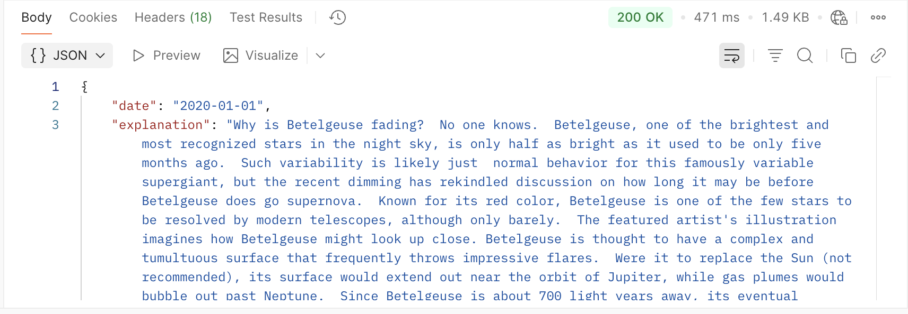
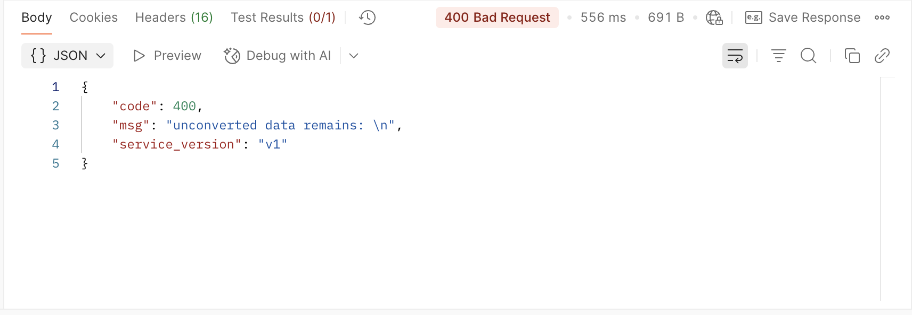

# NASA Astronomy Picture of the Day (APOD) API

## Overview

The NASA APOD API returns the astronomy picture of the day along with its title, description, and metadata. Each day features a different image or photograph of our fascinating universe, accompanied by a brief explanation written by a professional astronomer.

## Endpoint

`GET https://api.nasa.gov/planetary/apod`

## Authentication

This API requires an API key for authentication:

- **Demo usage**: Use `DEMO_KEY` for testing (limited to 30 requests per hour)
- **Production usage**: [Get your free API key](https://api.nasa.gov/) (1000 requests per hour)

## Request Parameters

| Parameter | Type | Required | Description | Example |
|-----------|------|----------|-------------|---------|
| `api_key` | string | Yes | Your NASA API key or `DEMO_KEY` | `DEMO_KEY` |
| `date` | string | No | Specific date in YYYY-MM-DD format. Defaults to today. | `2020-01-01` |
| `hd` | boolean | No | Retrieve high resolution image URL if available | `true` |
| `thumbs` | boolean | No | Return thumbnail URL for video content | `true` |

## Example Request

```http
GET https://api.nasa.gov/planetary/apod?api_key=DEMO_KEY&date=2020-01-01&hd=true
```

## Example Response

```json
{
  "date": "2020-01-01",
  "explanation": "Named for the shower's radiant point in the constellation Boötes, the Quadrantids are known for brief, bright meteors... (trimmed for brevity)",
  "hdurl": "https://apod.nasa.gov/apod/image/2001/Quadrantids_Aurora.jpg",
  "media_type": "image",
  "service_version": "v1",
  "title": "Quadrantid Meteors and Aurora over Alaska",
  "url": "https://apod.nasa.gov/apod/image/2001/Quadrantids_Aurora1024.jpg"
}
```

## Response Fields

| Field | Type | Description |
|-------|------|-------------|
| `date` | string | Date of the image (YYYY-MM-DD format) |
| `title` | string | Title of the image |
| `explanation` | string | Detailed explanation of the image |
| `url` | string | URL to the standard resolution image |
| `hdurl` | string | URL to the high resolution image (when available) |
| `media_type` | string | Type of media: "image" or "video" |
| `service_version` | string | API version |
| `thumbnail_url` | string | Thumbnail URL for video content (when thumbs=true, video only) |

## Testing in Postman

Here's what a successful request looks like in Postman:



## Error Responses

### 400 Bad Request

Occurs when request parameters are invalid or malformed.

```json
{
  "error": {
    "code": "BAD_REQUEST",
    "message": "Date must be between Jun 16, 1995 and [current date]"
  }
}
```



### 403 Forbidden

Occurs when API key is invalid or missing.

```json
{
  "error": {
    "code": "API_KEY_INVALID",
    "message": "An invalid api_key was supplied. Get one at https://api.nasa.gov/"
  }
}
```

### 429 Too Many Requests

Occurs when rate limit is exceeded.

```json
{
  "error": {
    "code": "OVER_RATE_LIMIT",
    "message": "You have exceeded your rate limit. Try again later."
  }
}
```

## Rate Limits

- **DEMO_KEY**: 30 requests per hour per API key
- **Registered API key**: 1,000 requests per hour per API key

## Notes

- Images are available starting from June 16, 1995
- Not all images have high-resolution versions available
- Video content will return a `thumbnail_url` when the `thumbs` parameter is set to `true`
- The API returns today's image by default when no date is specified

## Quick Start Example

```bash
# Get today's image
curl "https://api.nasa.gov/planetary/apod?api_key=DEMO_KEY"

# Get a specific date with high resolution
curl "https://api.nasa.gov/planetary/apod?api_key=DEMO_KEY&date=2020-01-01&hd=true"
```

---

**API Version:** v1  
**Doc Version:** v2.0  
**Last Updated:** Maintained regularly

For support or questions about this documentation, please check my [project repository](https://github.com/jerrybensonjr/api-samples). For the official NASA APOD API source and technical support, visit the [NASA Open Data Portal](https://api.nasa.gov/).
